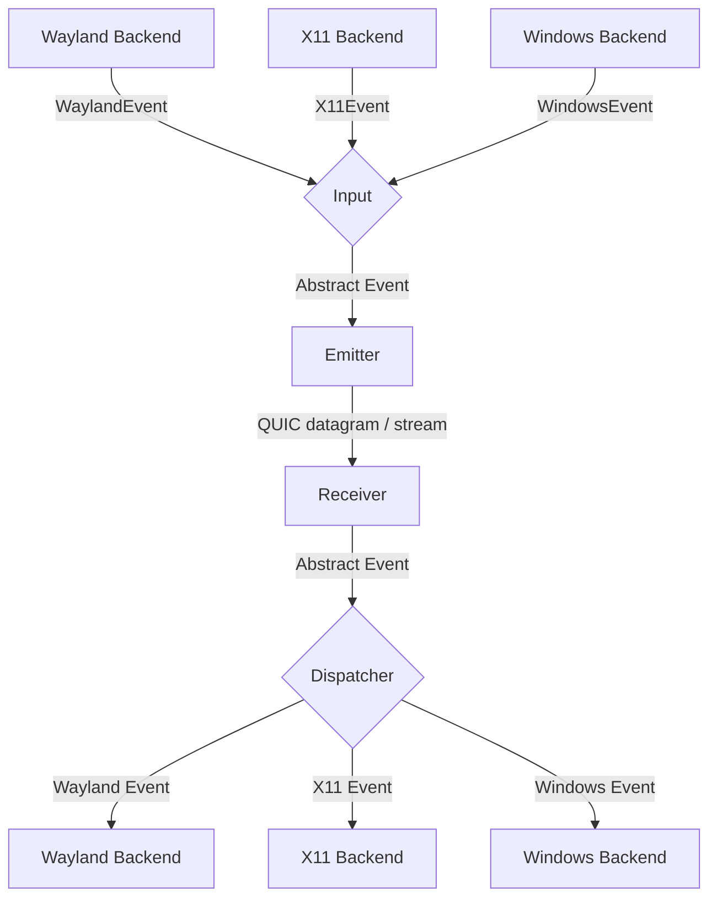
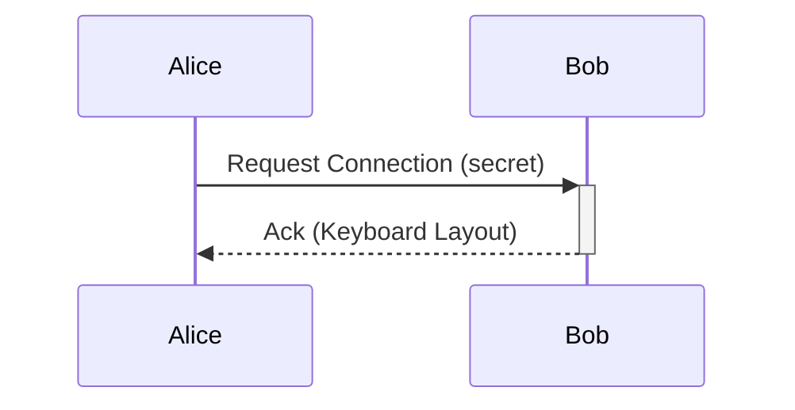

# General Software Architecture

## Events

Each instance of lan-mouse can emit and receive events, where
an event is either a mouse or keyboard event for now.

The general Architecture is shown in the following flow chart:

The wire transport is **QUIC over UDP** (quinn 0.11 + rustls 0.23 with the
`ring` crypto provider). Mouse motion is sent as a QUIC datagram; keyboard
events, mouse buttons, control messages, and the application-protocol Hello
handshake are sent over reliable, ordered QUIC streams. See
[`README.md` → Encryption & Transport](./README.md#encryption--transport)
for the full description of the v4 transport switch.

### Input
The input component is responsible for translating inputs from a given backend
to a standardized format and passing them to the event emitter.

### Emitter
The event emitter serializes events and sends them over the QUIC connection
to the correct client. Mouse motion goes over the connection's datagram
channel; the rest go over per-purpose streams (a single control stream plus
a bidirectional input stream). See
[Input channels (Stream vs Datagram)](./README.md#input-channels-stream-vs-datagram)
in the README for the per-client channel-mode configuration that controls
how mouse buttons and keyboard events are routed.

### Receiver
The receiver reads events from the QUIC connection and deserializes them
into the standardized event format. Datagrams are read directly via
`Connection::recv_datagram`; streams are framed with a length-prefixed
`[u32 BE length][body]` codec.

### Dispatcher
The dispatcher component takes events from the event receiver and passes them
to the correct backend corresponding to the type of client.

## Requests

// TODO this currently works differently

Aside from events, requests can be sent via a simple protocol. With the v4
transport switch there is no longer a separate TCP control channel —
connection setup, fingerprint authorization and the application-protocol
Hello handshake all travel over the same QUIC connection (reliable streams
on the same UDP port as the event datagrams).

## Problems
The general Idea is to have a bidirectional connection by default, meaning
any connected device can not only receive events but also send events back.

This way when connecting e.g. a PC to a Laptop, either device can be used
to control the other.

It needs to be ensured, that whenever a device is controlled the controlled
device does not transmit the events back to the original sender.
Otherwise events are multiplied and either one of the instances crashes.

To keep the implementation of input backends simple this needs to be handled
on the server level.

## Device State - Active and Inactive
To solve this problem, each device can be in exactly two states:

Either events are sent or received.

This ensures that
- a) Events can never result in a feedback loop.
- b) As soon as a virtual input enters another client, lan-mouse will stop receiving events,
which ensures clients can only be controlled directly and not indirectly through other clients.

## Configuration

The runtime configuration lives in `$XDG_CONFIG_HOME/lan-mouse/config.toml`
(defaults to `~/.config/lan-mouse/config.toml`) and is read on daemon /
CLI / GTK startup. The GTK frontend and the `lan-mouse cli` command
mutate the same file in place.

The authoritative, up-to-date schema and worked example are documented
in the project's `README.md` under the **Configuration** section:

- The full example config (release bind, port, `authorized_fingerprints`,
  each `[[clients]]` block) is reproduced there verbatim.
- Per-client input channel modes (`input_channels.mouse_button`,
  `input_channels.keyboard`) — the trade-off between **Stream 模式不丢操作**
  and **Datagram 模式丢操作** — are also described there, alongside the
  fact that **mouse motion always uses datagrams regardless of this
  setting**.

If you change `config.toml` while lan-mouse is running, restart the
daemon (or click the GTK frontend's refresh, when available) for the
new values to take effect; the file is not watched for live edits.

